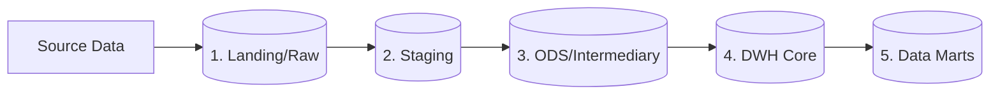

# SQL Data Warehouse Project - Extended

## 📋 Sobre o Projeto

Este é um projeto pessoal de Data Warehousing desenvolvido para aprofundar conhecimentos em Engenharia de Dados, modelagem dimensional e SQL avançado.

O projeto foi inicialmente inspirado no tutorial "SQL Data Warehouse Project" do [Data With Baraa](https://github.com/DataWithBaraa/sql-data-warehouse-project). No entanto, para simular um cenário corporativo mais complexo e robusto, expandi a arquitetura original de 3 camadas para **5 camadas de transformação de dados**, garantindo maior granularidade, rastreabilidade e qualidade de dados em cada etapa do pipeline.

### 🎯 Objetivos
* Construir um Data Warehouse do zero utilizando boas práticas de Engenharia de Dados.
* Implementar um pipeline de ETL/ELT robusto com múltiplas camadas de transformação.
* Demonstrar domínio em modelagem de dados (Star Schema/Snowflake Schema).
* Resolver problemas de negócio através de views e data marts otimizados para análise.

## 🏗️ Arquitetura Estendida (5 Layers)

Diferente da abordagem tradicional de 3 camadas (Staging -> Core -> Marts), este projeto adota uma arquitetura de 5 camadas para lidar melhor com a complexidade e qualidade dos dados:

### 🛠️ Tecnologias Utilizadas
- Banco de Dados:  SQL Server

- Linguagem: SQL (T-SQL)

- Ferramenta de Modelagem: Draw.io

- Ferramenta de BI: Power BI

 

## 📢 Créditos e Inspiração
Este projeto utiliza como base o excelente material educacional fornecido por Baraa no canal "Data With Baraa".

Repositório original: [Projeto Original](https://github.com/DataWithBaraa/sql-data-warehouse-project)

Tutorial em vídeo: https://www.youtube.com/watch?v=9GVqKuTVANE&list=PLYxb7-ibwWD5QJEWib6s4skEpCEVg2Nwg&index=17

A expansão para 5 camadas e as implementações subsequentes são autorais, visando estudo aprofundado além do tutorial original.

Desenvolvido por Rafael - [Linkedin](https://www.linkedin.com/in/rafaelboregs/)
